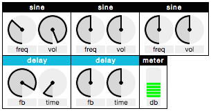
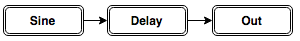
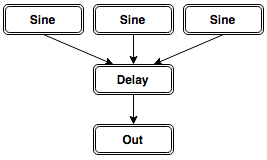
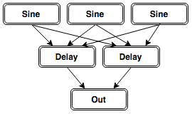

#WAM: Web Audio Modules



**WAM** is a collection of open-source modular computer music components built by the web audio community.

Each module includes a web audio engine & HTML5 GUI. Modules are written in js object literal notation, according to the WAM spec.

By encapsulating and sharing our common (& uncommon) computer music devices, WAM is designed to assist building expressive musical instruments in the browser.


## Building an Instrument

#### Assigning Context

Tell WAM about your current audio context: 

```js
WAM.setContext( ctx )
```


#### Adding Individual Modules

Individual modules can be added to your project using **WAM.*moduleName*()** and connected to each other (or to any web audio node) using `.connect()`

```js
var mySine = WAM.sine()
var myDelay = WAM.delay()
mySine.connect(myDelay)
myDelay.connect( WAM.out() )
```

By default, modules are positioned on the page relative to each other, within the flow of the document. To place a module precisely on the page, specify x/y when creating the module. Example: `WAM.sine(100,200)` will create a module 100 px from the left and 200 px from the top of the document.

#### Chaining Modules (recommended)

Groups of modules can be both created *and* connected using `WAM.route()`. This way you don't need to `.connect()` every module.

```js
var rack1 = WAM.route([
	WAM.sine(),
	WAM.delay(),
	WAM.out()
])
```

...creates the audiograph:



More complex audiographs can be created using `WAM.join()` along with `WAM.route()`:

```js
var rack1 = WAM.route([
	WAM.join( WAM.sine(), WAM.sine(), WAM.sine() ),
	WAM.delay(),
	WAM.out()
])
```

...creates the audiograph:



and this...

```js
var rack1 = WAM.route([
	WAM.join( WAM.sine(), WAM.sine(), WAM.sine() ),
	WAM.join( WAM.delay(), WAM.delay() ),
	WAM.out()
])
```

...creates the audiograph:



You can also connect groups:

```js
var rack1 = WAM.route([
	WAM.join( WAM.sine(), WAM.sine(), WAM.sine() ),
	WAM.delay()
])

var rack2 = WAM.route([
	WAM.join( WAM.sine(), WAM.sine(), WAM.sine() ),
	WAM.delay()
])

var rack3 = WAM.route([
	WAM.reverb(),
	WAM.out()
])

rack1.connect(rack3)
rack2.connect(rack3)
```


## Contributing Modules

**All users are encouraged to add modules to WAM! I am accepting all pull requests of working modules. These can be audio effects, signal generators, granular synths... the sky's the limit.** 

Modules are written as JS object literals within WAM.js. Each object follows the same pattern of properties and methods.

##### Example Module: "Sine" (sine oscillator with frequency and volume controls)

```js
Modules.sine = { 
	dependencies: [ "Tone" ],
	size: {
		w: 80,
		h: 52
	},
	audio: function() {
		this.toneosc = new Tone.Oscillator(440, "sine").start();
		this.toneosc.connect(this.output)
	},
	interface: [
		{
			type: "dial",
			label: "freq",
			action: function(data) {
				this.toneosc.frequency.value = data.value * 1000
			},
			size: {
				w: 40,
				h: 40
			},
			location: {
				x: 0,
				y: 0
			}
		},
		{
			type: "dial",
			label: "vol",
			action: function(data) {
				this.toneosc.volume.value = -100 + data.value*100
			},
			size: {
				w: 40,
				h: 40
			},
			location: {
				x: 40,
				y: 0
			}
		}
	]
}
```

##### But what does it all mean?

The core of a module is:

- A bit of web audio code (held in the `audio` function) which is executed once when the module loads.
- A list of NexusUI interface components which have actions that affect the audio code depending on data from the interface. Interface actions are executed whenever the interface is interacted with.

This is the same "sine" module with all size and location details removed. It should show a clearer picture of the module's core components.

```js
Modules.sine = { 
	audio: function() {
		this.toneosc = new Tone.Oscillator(440, "sine").start();
		this.toneosc.connect(this.output)
	},
	interface: [
		{
			type: "dial",
			label: "freq",
			action: function(data) {
				this.toneosc.frequency.value = data.value * 1000
			}
		},
		{
			type: "dial",
			label: "vol",
			action: function(data) {
				this.toneosc.volume.value = -100 + data.value*100
			}
		}
	]
}
```


## Anatomy of a Module

Each module also has the following built-in properties, which may be useful during development:

##### this.input

Gain node forming the audio input to the current module. This is connected to by other modules.

##### this.output

Gain node forming the audio output of the current module. This connects to other modules.

##### this.shell

The &lt;div&gt; containing the module.

##### this.components

An array of the NexusUI interface components in this module.

##### this.type

The type of this module (i.e. "sine").


## Anatomy of WAM


##### WAM.context

AudioContext, set with `WAM.setContext()`

##### WAM.modules

Array of modules created within the current project.

