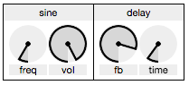

#WAM: Web Audio Modules


<br>*A sine oscillator module connected to a delay module*

**WAM** is a collection of modular computer music components –– each including an audio engine & GUI –– built by web audio community members.

WAM is designed to assist building expressive musical instruments in the browser.


### Using Modules

Modules can be connected together via stereo routing. The API for using modules is in construction.


### Adding Modules

**All users are encouraged to add modules to WAM. I am accepting all pull requests of working modules.** 

Modules are designed in JSON format within WAM.js. The JSON for the sine oscillator module looks like this:

```
Modules.sine = { 
	dependencies: [ "Tone" ],
	size: {
		w: 80,
		h: 52
	},
	audio: function() {
		this.toneosc = new Tone.Oscillator(440, "sine").start();
		this.toneosc.connect(this.output)
	},
	interface: [
		{
			type: "dial",
			label: "freq",
			action: function(data) {
				this.toneosc.frequency.value = data.value * 1000
			},
			size: {
				w: 40,
				h: 40
			},
			loc: {
				x: 0,
				y: 0
			}
		},
		{
			type: "dial",
			label: "vol",
			action: function(data) {
				this.toneosc.volume.value = -100 + data.value*100
			},
			size: {
				w: 40,
				h: 40
			},
			loc: {
				x: 40,
				y: 0
			}
		}
	]
}
```
